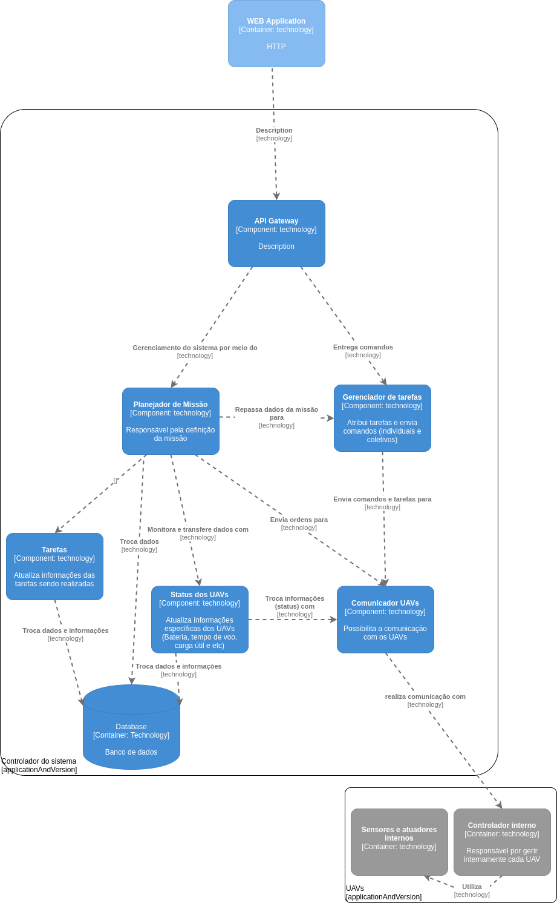

# Mysterio 👾
#### Guia de planejamento do Mysterio Framework

Para construir uma aplicação usando este framework, indicamos a nossa arquitetura que pode ser vista na figura a seguir:

Arquitetura de Software do Mysterio Framework

## Recomendações para construção de sistemas Multi-UAVs utilizando esta arquitetura e o Mysterio Framework:

#### UAVs e UAVCommunication
Para os UAVs, sejam virtuais ou reais, o software de gerenciamento interno dos UAVs tem que ser a sua maneira (desenvolvida pelo usuário), de forma que use o UAVCommunication como interface de comunicação entre o framework e os UAVs. É importante deixar claro que o framework deverá estar presente na sua estação base (central de comandos). Já o UAVCommunication presente em cada UAV, ele possui por padrão métodos que permite a conexão e a desconexão com o framework, além de envio e recebimento de mensagens.

> teste
>
> hehe

 .s 

#### Communication
* Este é o componente responsável por realizar toda e qualquer comunicação do framework com os UAVs.
* O UAVCommunication e este componente devem utilizar-se do mesmo protocolo de comunicação para se comunicarem.

...

Além do mais, você deve selecionar quais são as propriedades, atributos e características que irão funcionar como status dos UAVs na aplicação.
A classe Status é explicitamente a informação, já s Status Manager é a classe que o framework irá chamar quando for trabalhar com status. Esses que foram selecionados para serem gerenciados pelo framework nesse componente.
Você pode optar pode persistir também os dados de status por meio do componente Repository, esse que é responsável por armazenar no banco de dados, mas o ideal é saber lidar com toda a informação que recebe, se é ou não relevante para ser armazenada.
A Classe communication é a classe responsável por prover toda a comunicação entre o framework e os UAVs, conforme ele recebe mensagens, ele vai repassando para os componentes responsáveis em lidar com cada tipo específico de informação.
A classe Task simboliza uma tarefa
Já TaskManager é responsável por gerenciar e receber informações das tarefas
Por fim, a MissionPlanner tem toda a autonomia de gerenciamento da missão, está que é composta por um conjunto de tarefas designadas aos UAVs.
No Status, cada informação considerada como Status deve virar um atributo da classe ou derivar novas classes que armazenem diferentes atributos cada
Na Status Manager deve-se fazer pelo menos um método para cada Status, onde o componente repassará o status do(s) UAV(s) para outros componentes

Guia
Para o Status, o ideal é criar funções referentes a cada propriedade dos UAVs, assim deve criar funções para receber dos UAVs cada propriedade no framework.
Dados de Status como:
Bateria,
Tempo de vôo,
Localização/posição geográfica,
Velocidade,
Carga útil (se possuir),
Disponibilidade para realizar tarefas,
Se está fora de alcance de comunicação...

PARA O UAV, DEVE DEFINIR QUAIS SAO AS SUAS PROPRIEDADES PARA PODER VIRAR STATUS. O UAV DEVE USAR A INTERFACE DE COMUNICAÇÃO UAVCOMUNICATION PARA SE COMUNICAR COM O FRAMEWORK. JA DAS TAREFAS DO UAV, PODE SE TER DUAS ABORDAGENS, A PRIMEIRA SERIA NAO ESPECIFICAR DIRETAMENTE O QUE SERIA A TAREFA NA TAREFA, MAS PASSAR INDICAÇÕES DO Que SERIA ELA PARA O UAV Interpretar E ELE MESMO EXECUTAR A TAREFA.

JA A SEGUNDA ABORDAGEM SERIA ESPECÍFICAR A TAREFA E SEUS COMANDOS PARA QUE O UAV RECEBA A TAREFA E EXECUTE PROPRIAMENTE OS COMANDOS DA TAREFA

